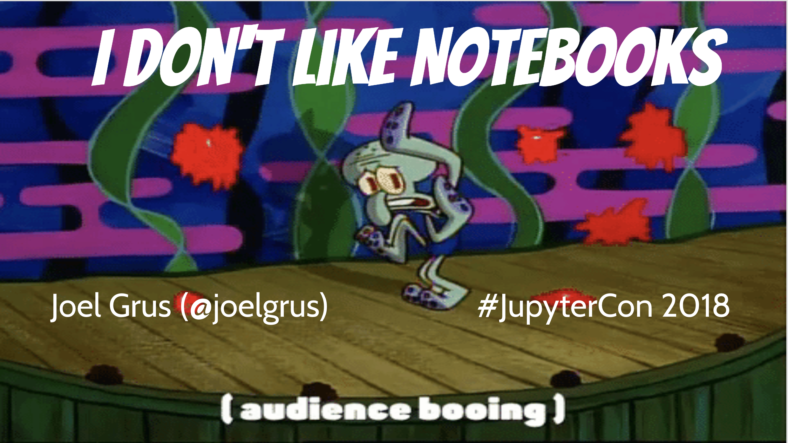
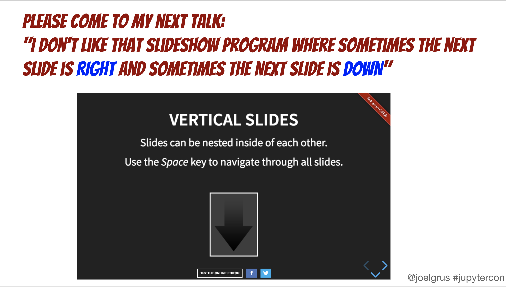
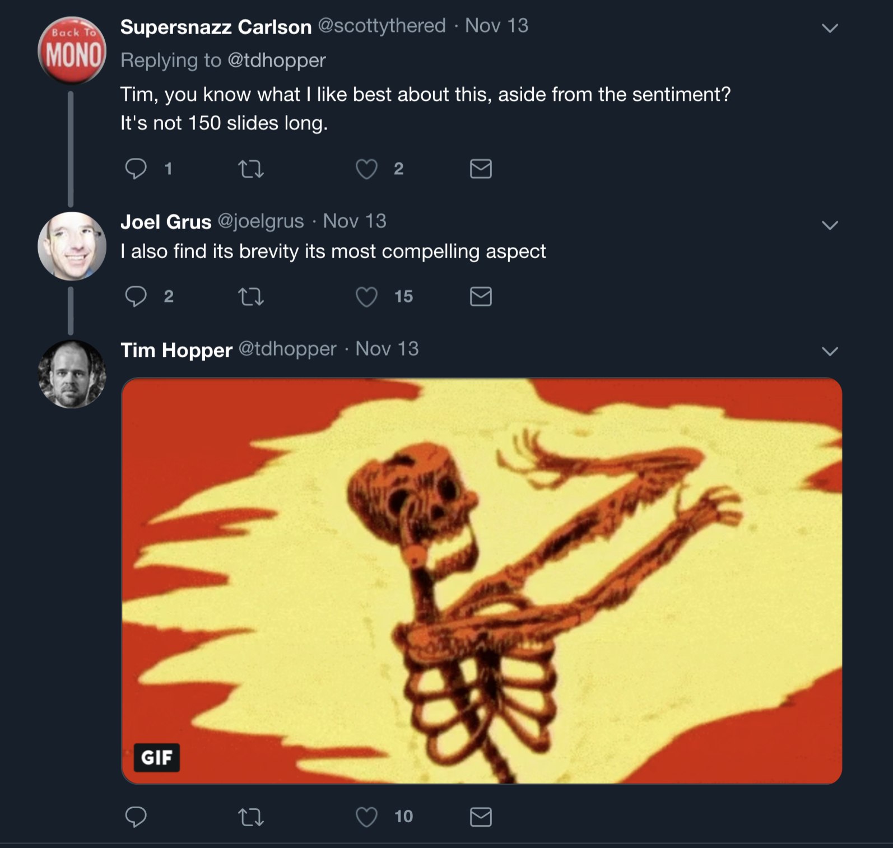

```{r setup, include=FALSE}
options(htmltools.dir.version = FALSE)
```

# About me

- Cancer Prevention Fellow 
  - at National Cancer Institute
- Co-Chair, Bioinformatics & Data Science
  - at Foundation for Advanced Education in the Sciences
- Website: https://marskar.github.io
- Twitter: [@marskar](https://twitter.com/marskar)

.center[]

---
# About this talk

- The title: inspired by [a tweet](https://twitter.com/pgbovine/status/1034626381735317504) by [Philip Guo (@pgbovine)](https://twitter.com/pgbovine)


---
# Previous conflicts

- Spaces versus Tabs
- Emacs versus Vim

 

- Source: https://goo.gl/images/U2KpcG

---
# Spaces versus Tabs

- Code editor setup: Tab = 4 spaces
- [GNU Make](https://www.gnu.org/software/make/) requires tabs!
- Use spaces, get paid more!
  - according to [blog post](https://stackoverflow.blog/2017/06/15/developers-use-spaces-make-money-use-tabs/) by [David Robinson (@drob)'s](https://twitter.com/drob)

.center[</img>]


---
# Notebooks

[Jupyter notebooks](https://jupyterlab.readthedocs.io/en/stable/user/notebook.html)
- are data science tools
- built on IPython by [Fernando Perez (@fperez)](https://twitter.com/fperez)
- combine [Markdown](https://www.markdownguide.org/) text, code, and output
- help data scientists communicate goals, methods, and results
- used in
    - [academia](https://www.oreilly.com/ideas/all-the-cool-kids-are-doing-it-maybe-we-should-too)
    - [Amazon](https://www.oreilly.com/ideas/machine-learning-and-ai-technologies-and-platforms-at-aws)
    - [Netflix](https://medium.com/netflix-techblog/scheduling-notebooks-348e6c14cfd6)
    - [PayPal](https://medium.com/paypal-engineering/paypal-notebooks-powered-by-jupyter-fd0067bd00b0)

.center[</img>]

---
# Joel doesn't like notebooks

- ["I Don't Like Notebooks"](https://conferences.oreilly.com/jupyter/jup-ny/public/schedule/detail/68282) by [Joel Grus (@joelgrus)](https://twitter.com/joelgrus) at Jupytercon 2018
- [Slides](https://t.co/30peBFwTbv)
- [Video](https://youtu.be/7jiPeIFXb6U)
- Modularity and Reusability



---
# Joel also doesn't like vertical slides



---
# [Tim likes notebooks](https://t.co/TjofhIRprv)



---
# DataFramed podcast
- Podcast by Hugo Bowne Andersen

---
# JupyterLab
- text editor and REPL

---
# Yihui

- [Blog post](https://yihui.name/en/2018/09/notebook-war/)
- [R notebooks](https://rmarkdown.rstudio.com/r_notebooks)
- these slides are made with R markdown!

---
@xieyihui

# Why use notebooks

- [Literate programming](http://www.literateprogramming.com/)
- Rendered by GitHub and nbviewer
- Google [colab](https://colab.research.google.com/)
- [Kaggle kernels](https://towardsdatascience.com/introduction-to-kaggle-kernels-2ad754ebf77)
- [Binder]()

@jakevplas

---
# Notebook tools

1. version control tool for notebooks - [nbdime]()
2. work with Jupyter notebooks, R markdown, and Julia, Python, and R scripts using [JupyText](https://github.com/mwouts/jupytext)
3. configure Jupyter Notebooks to run on markdown files with [notedown](https://github.com/aaren/notedown)
4. create and run Jupyter and R notebooks from scripts and markdown files with [nbless](https://github.com/marskar/nbless)

@mwouts 

---
# Write modules!

- Imports
    1. Standard Library
    2. Third Party
    3. User Defined
- Definitions
    - Classes
    - Functions
- Type Hints (Steven Lott's tutorial yesterday)
- Docstrings (with examples)
- `if __name__ == '__main__':`
- Function call(s), e.g. `doctest.testmod(verbose=True)`

---
# Thanks for listening!

---